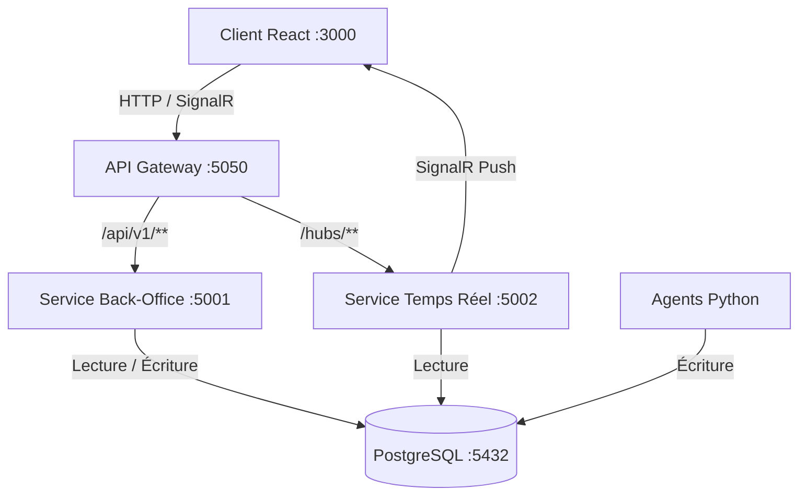
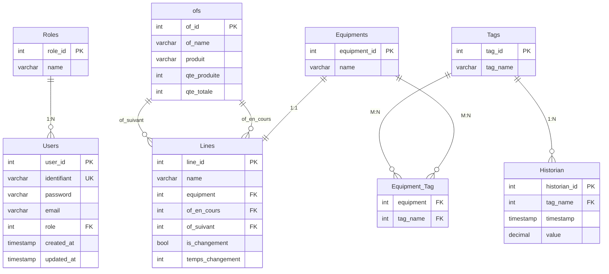

# Projet Dashboard de Production en Temps Réel

Tableau de bord de production affichant des métriques en temps réel. L'architecture repose sur des microservices ASP.NET Core communiquant via une API Gateway (YARP), un client React connecté en SignalR pour le temps réel, et des agents Python simulant des capteurs de production. Les données sont persistées dans PostgreSQL.

## Stack Technique

- **Backend** : ASP.NET Core 10.0 (architecture microservices)
- **API Gateway** : YARP (Yet Another Reverse Proxy)
- **Frontend** : React 19 + TypeScript + Tailwind CSS 4 + Vite 7
- **Communication temps réel** : SignalR (WebSockets)
- **Base de données** : PostgreSQL 16
- **Agents** : Python (psycopg2, python-dotenv)
- **Conteneurisation** : Docker & Docker Compose

## Fonctionnalités

- Affichage en temps réel des métriques de production via SignalR
- Sélection et suivi de lignes de production
- Historique des données de production (Historian)
- Gestion back-office (CRUD) : utilisateurs, rôles, lignes, équipements, tags, OFs
- Authentification JWT
- Notifications en temps réel pour les anomalies de production
- Simulation continue de données via agents Python

## Architecture



### Microservices

| Service | Port | Rôle |
|---------|------|------|
| **API Gateway** | 5050 | Point d'entrée unique, routage via YARP |
| **Back-Office** | 5001 (interne) | Opérations CRUD, authentification JWT |
| **Realtime** | 5002 (interne) | Hubs SignalR, broadcast des métriques |

### Flux de données

1. Les **agents Python** simulent des capteurs et écrivent les données dans PostgreSQL
2. Le **service Realtime** lit la base et diffuse les métriques en temps réel via SignalR
3. Le **client React** se connecte aux hubs SignalR via la gateway et affiche les métriques live
4. Le **service Back-Office** expose les API REST pour la gestion (CRUD) des entités

## Structure du Projet

```
├── gateway/                    # API Gateway (YARP reverse proxy)
│   └── ApiGateway/
├── services/
│   ├── backoffice/             # Service Back-Office (CRUD + Auth)
│   │   └── BackOfficeService/
│   │       ├── Controllers/    # Auth, Equipments, Lines, Ofs, Roles, Tags, Users
│   │       ├── DTOs/           # Objets de transfert par entité
│   │       ├── Models/         # Entités EF Core
│   │       ├── Repositories/   # Accès aux données
│   │       ├── Services/       # Logique métier
│   │       ├── Middleware/     # Gestion des erreurs
│   │       └── Data/           # DbContext + Migrations
│   └── realtime/               # Service Temps Réel (SignalR)
│       └── RealtimeService/
│           ├── Hubs/           # ProductionMetricsHub, NotificationsHub
│           ├── Services/       # MetricsBroadcastService
│           ├── Models/         # Entités en lecture seule
│           └── Data/           # RealtimeDbContext
├── server/                     # Backend monolithique legacy (remplacé par les microservices)
├── client/                     # Frontend React
│   └── src/
│       ├── pages/              # Login, Dashboard, ProductionDashboard, Backoffice (CRUD)
│       ├── components/         # UI, Auth, Layout
│       ├── services/           # Appels API + SignalR
│       ├── context/            # Contextes React
│       └── types/              # Types TypeScript
├── agents/                     # Agents Python
│   ├── seed_generation/        # Peuplement initial de la base (one-shot)
│   ├── line_agent/             # Simulation continue des lignes de production
│   └── requirements.txt
└── docker-compose.yml
```

## Schéma de Base de Données



## Instructions de Déploiement

### Avec Docker (recommandé)

```bash
# Lancer l'ensemble des services
docker-compose up --build

# Lancer uniquement la base de données
docker-compose up postgres pgadmin
```

### Accès

| Service | URL |
|---------|-----|
| Frontend | http://localhost:3000 |
| API Gateway | http://localhost:5050 |
| pgAdmin | http://localhost:8080 |
| PostgreSQL | localhost:5432 |

### Identifiants par défaut

- **PostgreSQL** : `postgres` / `postgres` (base : `production_dashboard`)
- **pgAdmin** : `admin@example.com` / `admin`
- **Connexion site admin** : `admin` / `admin123`
- **Connexion site viewer** : `viewer` / `admin123`

### Développement local

```bash
# Backend (depuis services/backoffice/BackOfficeService ou services/realtime/RealtimeService)
dotnet restore && dotnet run

# Frontend
cd client && npm install && npm run dev    # http://localhost:5173

# Agents
cd agents && pip install -r requirements.txt
python -m seed_generation                   # Peuplement initial
python -m line_agent --line-ids 1 2         # Simulation continue
```

## Auteurs

- Cyprien.G
- Tristan.G