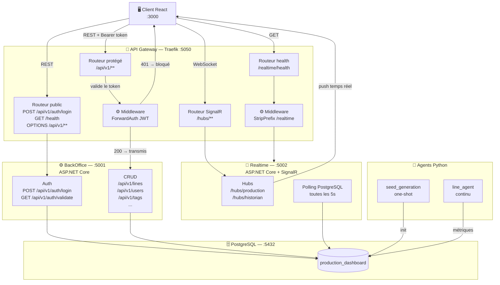

# Projet Dashboard de Production en Temps Réel

Ce projet est une application de monitoring de production en temps réel, conçue pour afficher les métriques clés d'une ligne de production industrielle. Il utilise une architecture moderne basée sur une API Gateway (Traefik) pour gérer les requêtes, un backend ASP.NET Core pour l'API REST et la diffusion en temps réel via SignalR, un frontend React pour l'interface utilisateur, et une base de données PostgreSQL pour stocker les données de production.

## Rendu + Expériences

| Branche | État | Commentaire |
|---|---|---|
| stable | Fonctionnel | Projet complet |
| add_grafana | Fonctionnel | Ajout d'un container grafana avec un dashboard simple des données de prod |
| rabbitmq | Fonctionnel | Ajout d'un container rabbitmq avec un back C# permettant de contrôler via le front, les lignes de production (marche/arrêt) |

## Credentials

- **PostgreSQL** : `postgres` / `postgres` (base : `production_dashboard`)
- **pgAdmin** : `admin@example.com` / `admin`
- **Connexion site admin** : `admin` / `admin123`
- **Connexion site viewer** : `viewer` / `admin123`
- **Grafana** : `admin` / `admin`

## Stack Technique

- **Gateway** : Traefik v3.2 — routage, ForwardAuth JWT
- **BackOffice** : ASP.NET Core 10.0 — API REST CRUD + authentification JWT
- **Realtime** : ASP.NET Core 10.0 + SignalR — diffusion temps réel
- **Frontend** : React + TypeScript + Tailwind CSS (Vite)
- **Agents** : Scripts Python simulant des capteurs de production
- **Base de données** : PostgreSQL 16
- **Conteneurisation** : Docker + Docker Compose

## Architecture



## Fonctionnalités

- Authentification JWT avec validation au niveau gateway (ForwardAuth)
- Affichage en temps réel des métriques de production via SignalR
- Sélection de la ligne de production à surveiller
- Historique des données de production
- Notifications en temps réel pour les anomalies
- Simulation de données via des agents Python

## Routes exposées (port 5050)

| Route | Méthode | JWT | Destination |
|---|---|---|---|
| `/api/v1/auth/login` | POST | Non | backoffice:5001 |
| `/health` | GET | Non | backoffice:5001 |
| `/api/v1/**` | * | Oui (ForwardAuth) | backoffice:5001 |
| `/hubs/**` | WS | Non* | realtime:5002 |
| `/realtime/health` | GET | Non | realtime:5002 |

*JWT géré par le RealtimeService via query parameter.

## Structure du Projet

```
.
├── .env                        # Variables d'environnement (gitignored)
├── docker-compose.yml
├── traefik/
│   ├── traefik.yml             # Config statique Traefik (entrypoints, provider)
│   └── dynamic/
│       └── config.yml          # Config dynamique (routers, middlewares, services)
├── services/
│   ├── backoffice/             # API REST + auth JWT (ASP.NET Core :5001)
│   └── realtime/               # SignalR hub (ASP.NET Core :5002)
├── client/                     # Frontend React + TypeScript + Tailwind
└── agents/                     # Scripts Python de simulation
    ├── seed_generation/        # Seeding initial de la BDD (one-shot)
    └── line_agent/             # Simulation continue des lignes de production
```

## Démarrage

### Prérequis

- Docker + Docker Compose

### Configuration

```bash
# Copier et adapter le fichier d'environnement
cp .env.example .env  # puis éditer JWT_SECRET_KEY, mots de passe, etc.
```

Variables clés dans `.env` :

| Variable | Description |
|---|---|
| `POSTGRES_PASSWORD` | Mot de passe PostgreSQL |
| `JWT_SECRET_KEY` | Clé secrète de signature JWT (min. 32 caractères) |
| `CORS_ALLOWED_ORIGINS` | Origines autorisées (ex: `http://localhost:3000`) |
| `GATEWAY_PORT` | Port d'écoute de Traefik (défaut: `5050`) |

### Lancement

```bash
# Tout démarrer
docker-compose up --build

# Services seuls (dev)
docker-compose up --build gateway backoffice realtime

# Base de données uniquement
docker-compose up postgres pgadmin
```

## Schéma de Base de Données

| Table | Colonnes principales |
|---|---|
| `"Users"` | id, username, password_hash, role, created_at |
| `"Roles"` | role_id, name |
| `"Lines"` | id, name, equipment, of_en_cours, of_suivant, is_changement |
| `"Equipments"` | id, name |
| `"Tags"` | tag_id, name, unit |
| `"Historian"` | id, tag_name (FK Tags), timestamp, value |
| `"Equipment_Tag"` | equipment (FK), tag_name (FK) |
| `ofs` | id, name, quantity |


## Auteurs

- Cyprien.G
- Tristan.G
