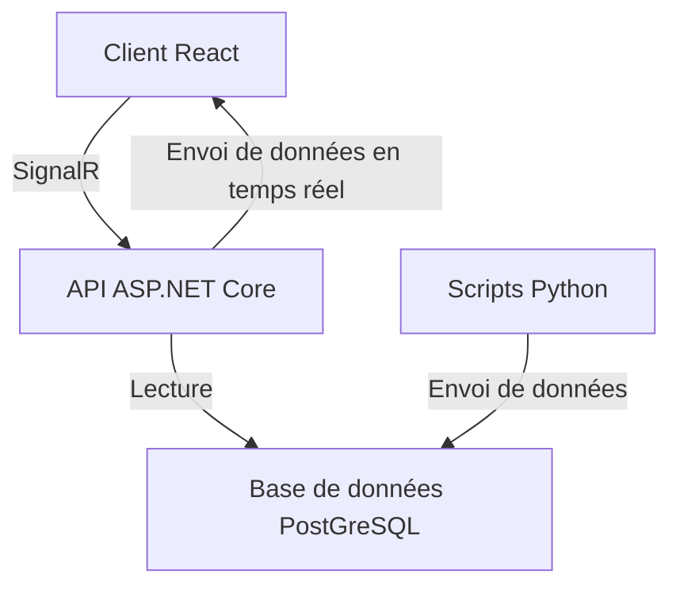
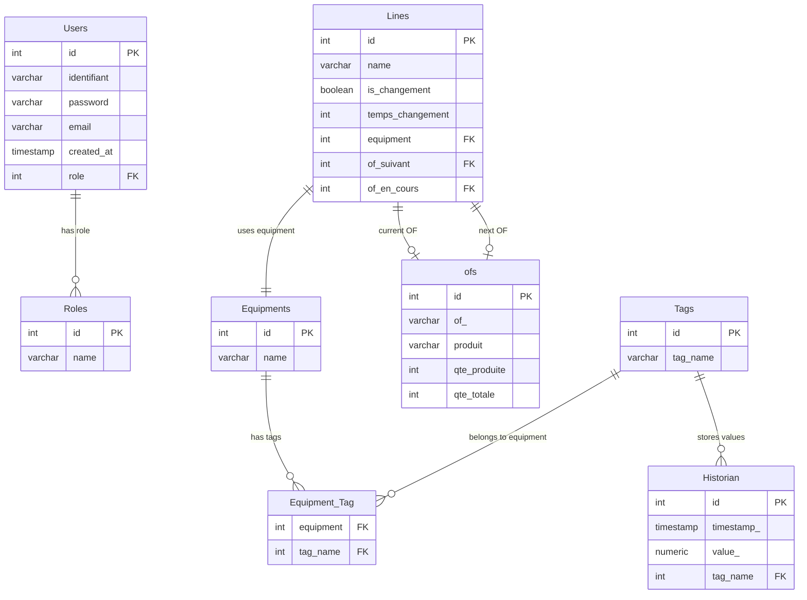
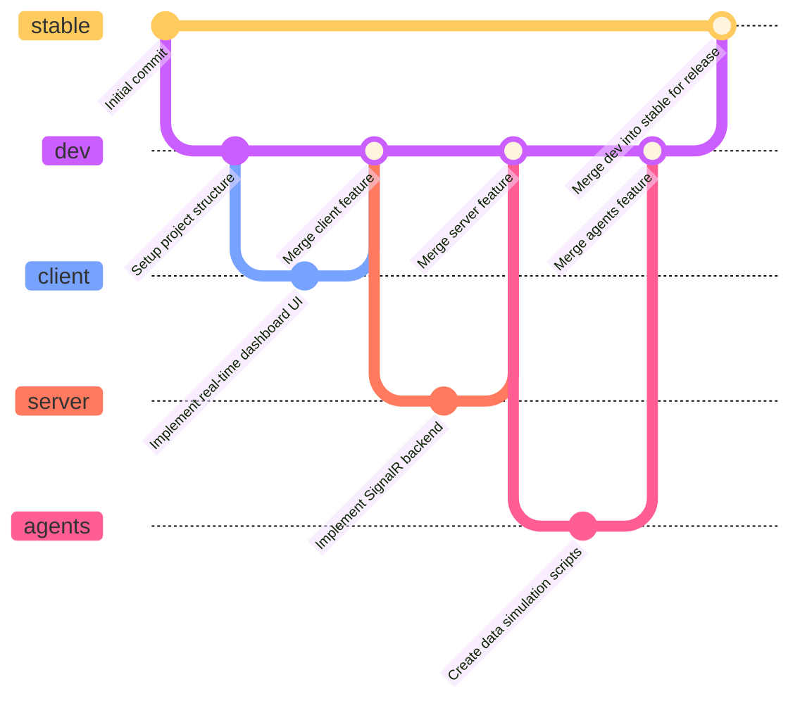

# Projet Dashboard de Production en Temps Réel

Le but du projet est d'avoir une API back en ASP.NET Core avec la librairie SignalR pour gérer une communication en temps réel avec un client front en React. Le projet consiste en la création d'un tableau de bord de production affichant des métriques en temps réel.

## Stack Technique

- Backend : ASP.NET Core avec SignalR
- Frontend : React avec TypeScript et Tailwind CSS
- Communication : SignalR pour la communication en temps réel entre le client et le serveur
- Base de donnée : PostGreSQL
- Agents de remplissage : Scripts Python simulant des capteurs de production
- Conteneurisation : Docker et Docker Compose pour le déploiement

## Fonctionnalités

- Affichage en temps réel des métriques de production (taux de production, taux de défauts, etc.)
- Interface utilisateur réactive avec React
- Communication bidirectionnelle entre le client et le serveur via SignalR
- Simulation de données de production via des scripts Python
- Conteneurisation de l'application pour un déploiement facile
- Choix de la ligne de production à surveiller
- Historique des données de production
- Authentification des utilisateurs
- Notifications en temps réel pour les anomalies de production
- Tableau de bord personnalisable (A voir selon le temps disponible)

## Structure du Projet
- `client/` : Contient le code source du client React
- `server/` : Contient le code source de l'API ASP.NET Core
- `agents/` : Contient les scripts Python pour simuler les capteurs de production
- `docker-compose.yml` : Fichier de configuration Docker Compose pour le déploiement

## Instructions de Déploiement

1. Cloner le dépôt
2. Naviguer dans le répertoire du projet
3. Lancer Docker Compose : `docker-compose up --build`
4. Accéder au client via `http://localhost:5173` et à l'API via `http://localhost:5000`
5. Lancer les scripts Python pour simuler les données de production
6. Profiter du tableau de bord en temps réel !

## Schéma SQL

Il y aura : 

- Une table Users pour gérer les utilisateurs (id, username, password_hash, role, created_at)
- Une table ProductionLines pour gérer les lignes de production (id, name, description, OF_en_cours, OF_suivant)
- Une table Metrics pour stocker les métriques de production (id, production_line_id, timestamp, production_rate, defect_rate, downtime)
- Une table Historian pour stocker les données des capteurs (id, tag_name, timestamp, value)

## GitFlow
- La branche `stable` contient le code stable et déployable
- La branche `dev` est utilisée pour le développement quotidien et provient de la branche `stable`
- La branche `docs` est utilisée pour la documentation du projet et provient de la branche `stable`
- La branche `client` est utilisée pour le développement du client React et provient de la branche `dev`
- La branche `server` est utilisée pour le développement de l'API ASP.NET Core et provient de la branche `dev`
- La branche `agents` est utilisée pour le développement des scripts Python et provient de la branche `dev`
- Les branches de fonctionnalités (feature branches) sont créées à partir des branches `client`, `server` ou `agents` selon le type de fonctionnalité à développer. Une fois la fonctionnalité terminée, elle est fusionnée dans la branche correspondante.

## Auteurs

- Cyprien.G
- Tristan.G